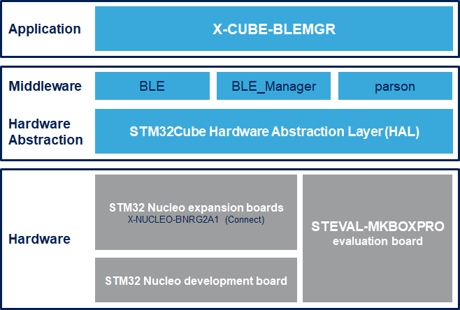

# X-CUBE-BLEMGR Firmware Package

The X-CUBE-BLEMGR is an expansion software package for STM32Cube.
This software provides middleware to help the user to set and configure bluetooth connectivity from board to mobile application such as ST BLE Sensor.
This software package is built on top of STM32Cube software technology that ease portability across different STM32 microcontrollers.

The software runs on the STM32 microcontroller and includes all the necessary drivers to recognize the devices on the STM32 Nucleo development board and expansion boards.

The expansion is built on STM32Cube software technology to ease portability across different STM32 microcontrollers.

**X-CUBE-BLEMGR software features**

- Complete middleware to build applications for bluetooth connectivity with mobile application such as ST BLE Sensor

- Sample applications that the developer can use to start experimenting with the code

- References to free Android and iOS Apps that can be used along with the sample applications

- Easy portability across different MCU families, thanks to STM32Cube

- Free, user-friendly license terms

This firmware package includes Components Device Drivers, Board Support Package and example application for the STMicroelectronics:

- NUCLEO-L476RG nucleo development board and expansion boards:
  - X-NUCLEO-BNRG2A1 Bluetooth Low energy expansion boards

Here is the list of references to user documents:

- [DB4774: Bluetooth Low Energy manager software expansion for STM32Cube](https://www.st.com/resource/en/data_brief/x-cube-blemgr.pdf)
- [UM3051: Getting started with the X-CUBE-BLEMGR Bluetooth Low Energy manager software expansion for STM32Cube](https://www.st.com/resource/en/user_manual/um3051-getting-started-with-the-xcubeblemgr-bluetooth-low-energy-manager-software-expansion-for-stm32cube-stmicroelectronics.pdf)

## Supported Devices and Boards

- NUCLEO-L476RG STM32 Nucleo-64 development board with STM32L476RG MCU, supports Arduino and ST morpho connectivity \[[NUCLEO-L476RG](https://www.st.com/content/st_com/en/products/evaluation-tools/product-evaluation-tools/mcu-mpu-eval-tools/stm32-mcu-mpu-eval-tools/stm32-nucleo-boards/nucleo-l476rg.html)\]
- X-NUCLEO-BNRG2A1 Bluetooth Low Energy expansion board based on the BLUENRG-M2SP module for STM32 Nucleo \[[X-NUCLEO-BNRG2A1](https://www.st.com/en/ecosystems/x-nucleo-bnrg2a1.html)]

## Development Toolchains and Compilers

-   IAR Embedded Workbench for ARM (EWARM) toolchain V9.20.1 + STLink/V2
-   RealView Microcontroller Development Kit (MDK-ARM) toolchain V5.37.0 + ST-LINK/V2
-   Integrated Development Environment for STM32 (STM32CubeIDE) V1.11.0 + ST-LINK
	
## Dependencies 

This software release is compatible with:

- [**ST BLE Sensor Android application**](https://play.google.com/store/apps/details?id=com.st.bluems)  V4.17.0 (or higher)
- [**ST BLE Sensor iOS application**](https://apps.apple.com/it/app/st-ble-sensor/id993670214)  V4.17.0 (or higher)
